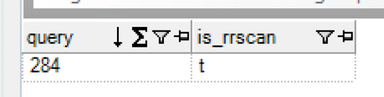

# Purpose

Provide a very brief demonstration to show that Amazon Redshift's query optimizer works with database views. 

## Why? 

I recently had a customer ask whether Redshift's query optimizer works with views because they had read (somewhere on the internet) that the optimizer would not work with views. 

While this might have been true at one point (I don't know), at least today (Jan 2020, or earlier), the optimizer works with views.

Examples of old articles promoting the idea that the optimizer does not work with views include: 

* 2016 - https://discourse.snowplowanalytics.com/t/should-i-use-views-in-redshift/410
* Early 2017 - https://www.intermix.io/blog/top-14-performance-tuning-techniques-for-amazon-redshift/

## Test Scope / Disclaimer

For my simple tests, I define the optimizer as "working with views" if it correctly making use of distribution and sort keys with simple queries. Of course, the tests could be expanded (e.g. more complex queries, additional constraints such as PKs or FKs), but I opted to keep things simple.

That being said, happy to add additional tests... just raise an issue on this repo. 

# Setup

For this demonstration, I will use a subset of tables generated from the TPC-DS dataset. Specifically: 

1. **item** table, which has a distribution key of `item_sk` (item ID) and a sort key of `i_category` (item category)

2. **store_sales** table, which has a distribution key of `ss_item_sk` (item ID) and a sort key of `ss_sold_date_sk` (sold date)

# Tests

## Sort keys

While Redshift's `EXPLAIN` will show you a query plan, the plan will not indicate whether sort keys are would be utilized to reduce the number of scanned rows in a query. Instead, you may inspect the `SVL_QUERY_SUMMARY` view and inspect the `is_rrscan` column. Here, a value of `y` indicates that a range-restricted scan occurred - in other words, that a sort key was leveraged to reduce the number of rows scanned.

1. First, let's query our **item** table using the sort key `i_item_sk` in a WHERE predicate: 

  ```sql
  select i_item_id, i_current_price from item where i_category = 'Home' limit 10;
  ```

  

2. Now, let's find our query's ID from the **SVL_QLOG** view: 

  ```sql
  select * from SVL_QLOG where userid=100 and substring like 'select i_item_id, i_current_price%';
  ```

  

  Above, note that our query ID is `284`. 

3. Using our query ID `284`, we can inspect the **SVL_QUERY_SUMMARY** view to determine whether a range-restricted scan occurred (i.e. `is_rrscan = 'y'`):

  ```sql
  select query, is_rrscan from SVL_QUERY_SUMMARY where query = 284 and is_rrscan = 't';
  ```

  

  Above, we can see that a range-restricted scan on a table was used. In other words, our sort key of `i_category = 'Home` was leveraged by the query optimizer to avoid scanning unecessary rows. 

4. Let's create a simple view on the same **item** table from above. Note that we include a a few additional columns that we will use in later tests, too): 

  ```sql
  CREATE VIEW item_view AS (
    select i_item_sk, i_item_id, i_current_price, i_category from item
  );
  ```

5. Query our view, again using a WHERE predicate on **i_category** to (hopefully!) result in a range-restricted scan: 

  ```sql
  select i_item_id, i_current_price from item_view where i_category = 'Home' limit 10;
  ```

  

6. Again, find our query ID: 

  ```sql
  select * from SVL_QLOG where substring like 'select i_item_id, i_current_price from item_v%';
  ```

  

  Our query ID is `345`. 

7. Finally, we confirm a range-restricted scan was used for query `345`:

  ```sql
  select query, is_rrscan from SVL_QUERY_SUMMARY where userid=100 and query = 345 and is_rrscan = 't';
  ```

  

## Hash keys

A standard `EXPLAIN` command may be used to demonstrate whether or not the query optimizer is taking advantage of hash keys. 

In the example below, I show the query plan to join the **item_view** view we created above to our **store_sales** table, which both use `item_sk` as a distribution key:

  ```sql
  EXPLAIN (
    select * from item_view as t1 join store_sales as t2 on t1.i_item_sk = t2.ss_item_sk limit 10
  );
  ```

  

Above, we can see that the query optimizer is correctly planning a HASH join between our view and table.